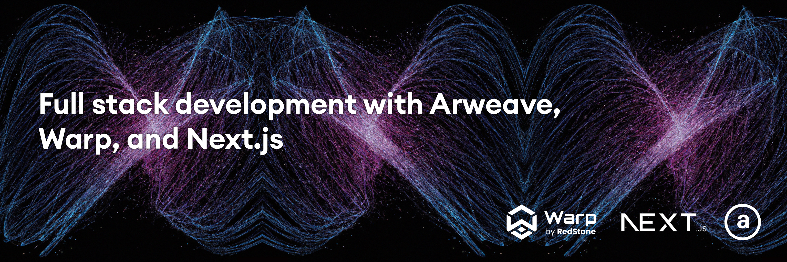

# Full stack development with Arweave, Warp, and Next.js



This is an example of how to build a full stack application on Arweave with smart contracts running on Smarweave via Warp Protocol

## Getting started

### Prerequisites

To run this app, you should have:

- Node.js installed on your machine
- [ArConnect](https://www.arconnect.io/) wallet extension
  
### Deploying and testing on mainnet

- Retreive Arweave tokens (available from the faucet [here](https://faucet.arweave.net/) or from an exchange)
- Install [ArConnect wallet](https://www.arconnect.io/)
- Download and save wallet in a file named `wallet.json`

## Running this project

To run the app, follow these steps:

1. Clone the project

```sh
git clone git@github.com:dabit3/full-stack-warp-arweave.git
```

2. Change into the directory and install the dependencies

```sh
cd full-stack-warp-arweave

npm install

# or

yarn
```

3. Deploy the contract to testnet

From the `warp` directory, run the following command:

```
node deploy
```

4. Run the Next.js app

From the root directory, run the following command:

```sh
npm run dev
```

## Running on mainnet

1. Set local environment variable to mainnet in the terminal session you will be deploying from:

```sh
export WARPENV=mainnet
```

2. Create `.env.local` file in the root of the app and add the following environment variable:

```
NEXT_PUBLIC_WARPENV=mainnet
```

3. Deploy the contract to testnet

From the `warp` directory, run the following command:

```
node deploy
```

4. Run the Next.js app

From the root directory, run the following command:

```sh
npm run dev
```